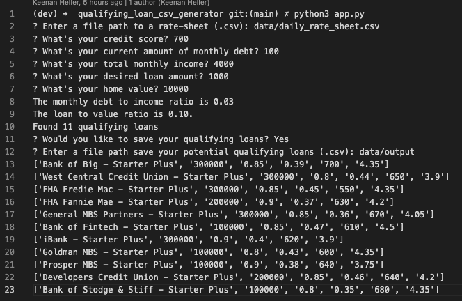
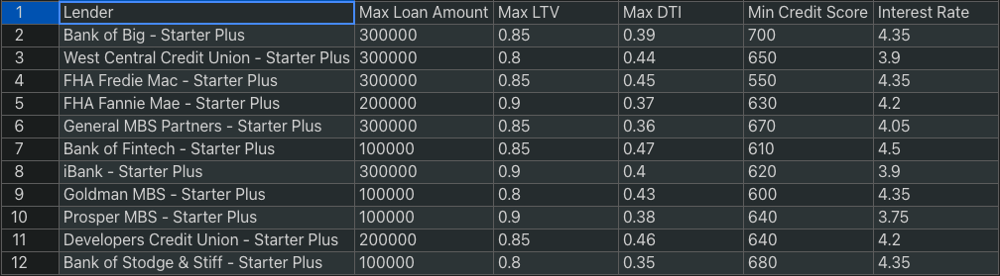

# Qualifying Loan App

This command line tool uses loan data from different brokerages and the users personal data to see if they qualify or not for a loan.  If  you do, the user can choose whether or not they'd like to save their qualified loan data to a csv file in the location of their choosing. 

---

## Technologies

Technologies included are fire, sys, questionary, csv, and pathlib.

---

## Installation Guide

You can easily install this by cloning the repository to a desired space on your computer. Then, navigate to the directory above the "app.py" file and type "python3 app.py".

---

## Usage

---

## Contributors

Name: Keenan Heller
Email: keenanaheller@gmail.com
LinkedIn: https://www.linkedin.com/in/keenanheller/
---

## License

MIT License
